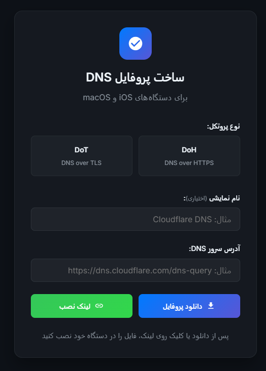

🎯 ساخت آنلاین پروفایل DNS برای iOS/macOS (.mobileconfig)
📱 برای استفاده از DoH و DoT روی آیفون و مک — بدون نیاز به اپ!

💡 می‌خوای خودت بسازی و روی دامنه خودت استفاده کنی؟ اینم آموزش ساخت!

☁️ ۲. آپلود در Cloudflare Worker:
وارد حساب Cloudflare شو.

از بخش Workers & Pages، یک Worker جدید بساز.

کد بالا رو جایگزین کن.

